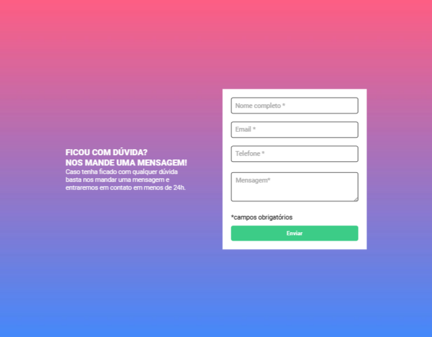
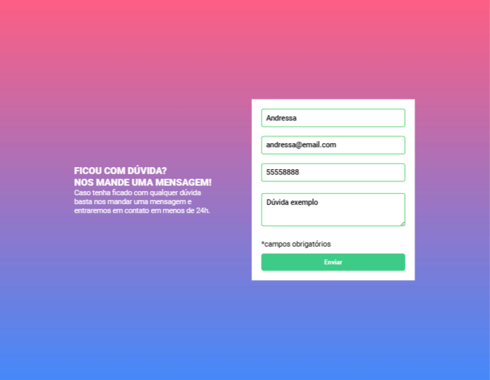

# ✨Formulario com validação 👩‍💻

Desafio de JavaScript  para criação de um formulário com validação

## Challenges 🚀

- O objetivo principal foi a criar um formulário de validação usando JavaScript, seguindo os design de orientação:

- Validação confirmada: ✅

- Validação não confirmada: ⛔

- Os usuários devem ser capazes de: 
    - interagir com a página
    
    - Ver os estados de foco para todos os elementos interativos na página

    - orientar-se por meio elementos

- Desenvolvi habilidades em JavaScript, HTML e CSS ✅

## My process 🚀

- Criação de formulários usando Semantic HTML5 markup 👩‍💻

- Posicionamento de elementos no CSS 👩‍💻

- Validação de Dados no Javascript; 👩‍💻